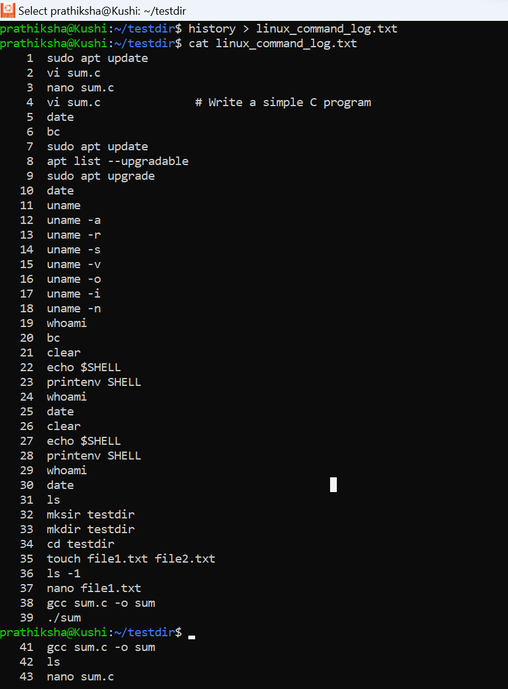
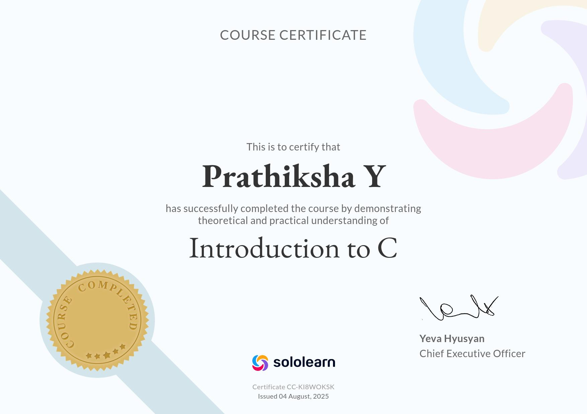

 5184078_Prathiksha-Y
 ## ✅ SDLC Completion
**Key Concepts Learned:**  
- Gained a clear understanding of the **SDLC phases**: Requirement Gathering, Design, Development, Testing, Deployment, and Maintenance.  
- Recognized the importance of **planning, documentation, and process management** in ensuring project success.  
- Understood the distinct **roles and responsibilities** of developers, testers, and stakeholders throughout the lifecycle.  
- Explored various **software development models**, including Waterfall, Agile, and Iterative, along with their practical applications.  

### GIT Certificate
**Key Concepts Learned:**  
- Gained an understanding of **Version Control Systems (VCS)** and the importance of Git in modern software development.  
- Practiced essential Git commands: `git init`, `git add`, `git commit`, `git push`, and `git pull`.  
- Learned to work with **branches** for feature development and effective collaboration.  
- Developed skills in **resolving merge conflicts** and maintaining a clean, structured commit history.  
- Explored **GitHub** for hosting, managing, and collaborating on repositories.  

### Linux commands
**Key Concepts Practiced:**  
- Navigated directories and performed efficient **file management** operations.  
- Created, viewed, and edited files using tools like **nano, cat, head, and tail**.  
- Practiced **text manipulation** with commands such as `sort`, `cut`, and `rev`.  
- Applied **searching and text replacement** techniques using `grep` and `sed`.  
- Utilized `awk` for **text processing and data extraction**.  
- Managed **file permissions** effectively with `chmod`.  
- Gained hands-on experience with **piping and I/O redirection** for combining commands.  

<h2>Linux Assessment Screenshots</h2>

  
  

 

  
  

### C PROGRAM
 **Topics Covered:**  
- Understood the **structure of a C program** and its execution flow.  
- Worked with **data types, variables, and constants** for effective memory usage.  
- Implemented **conditional statements and loops** (`if`, `for`, `while`, `switch`) for control flow.  
- Applied **preprocessor directives** (`#include`, `#define`) to manage code.  
- Practiced **compilation and debugging** using GCC.  
- Wrote **modular and reusable code** with functions and header files.  
- Explored **pointers and pointer arithmetic** for memory access and manipulation.  
- Implemented **functions** (user-defined and recursive) for structured programming.  
- Worked with **arrays (1D & multi-dimensional)** and applied **string handling techniques**.  
- Gained hands-on experience with **dynamic memory allocation** (`malloc`, `calloc`, `free`).  
- Learned to use **structures and typedef** for organizing complex data.  
- Practiced **file handling operations** (read, write, append) in C.  
- Explored **preprocessor operators** for advanced program control.  

# Certificates

## C Intermediate – SoloLearn

